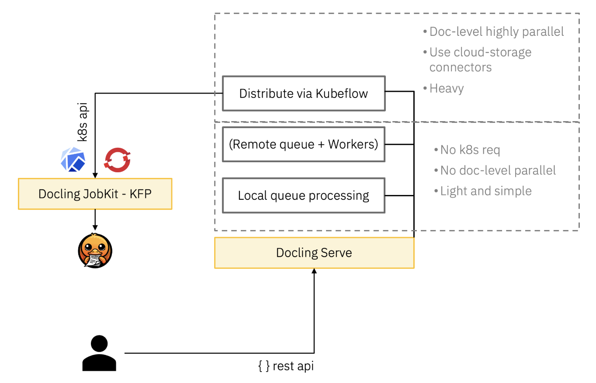

# Docling Operator
The Docling Operator distributes [docling-serve](https://github.com/docling-project/docling-serve) together with the [docling-jobkit](https://github.com/docling-project/docling-jobkit) Kubeflow jobs.

## Description
The Docling Operator configures the docling-serve API Deployment and related Secret, ConfigMap, Service. It also configures the docling-kfp-job Data Science Pipeline for running the distributed Docling conversion. This is launched and inspected from docling-serve using the k8s api. With docling-serve you can deploy with different compute engines.
With the docling operator you can configure which compute engine to use for the deployment.



## Getting Started

### Prerequisites
- go version v1.24.1+
- docker version 17.03+.
- kubectl version v1.11.3+.
- Access to a Kubernetes v1.11.3+ cluster.

### Kubeflow Pipeline Engine

The engine is set to local by default. To deploy a Kubeflow Pipeline engine, adjust the custom resource at `config/samples/docling_v1alpha1_doclingserve.yaml` and add a Kubeflow endpoint.

```
engine:
    kfp:
      enpoint: <kubeflow-endpoint>
```

### To Deploy on the cluster

```sh
git clone https://github.com/opdev/docling-operator.git
```
```sh
cd <project>
```
```sh
make generate
```
```sh
make manifests
```

**Build and push your image to the location specified by `IMG`:**

```sh
make docker-build docker-push IMG=<some-registry>/docling-operator:tag
```

**NOTE:** This image ought to be published in the personal registry you specified.
And it is required to have access to pull the image from the working environment.
Make sure you have the proper permission to the registry if the above commands don’t work.

**Install the CRDs into the cluster:**

```sh
make install
```

**Deploy the Manager to the cluster with the image specified by `IMG`:**

```sh
make deploy IMG=<some-registry>/docling-operator:tag
```

> **NOTE**: If you encounter RBAC errors, you may need to grant yourself cluster-admin
privileges or be logged in as admin.

**Create instances of your solution**
You can apply the samples (examples) from the config/sample:

```sh
kubectl apply -k config/samples/docling_v1alpha1_doclingserve.yaml
```

>**NOTE**: Ensure that the samples has default values to test it out.

### To Uninstall
**Delete the instances (CRs) from the cluster:**

```sh
kubectl delete -k config/samples/docling_v1alpha1_doclingserve.yaml
```

**Delete the APIs(CRDs) from the cluster:**

```sh
make uninstall
```

**UnDeploy the controller from the cluster:**

```sh
make undeploy
```
